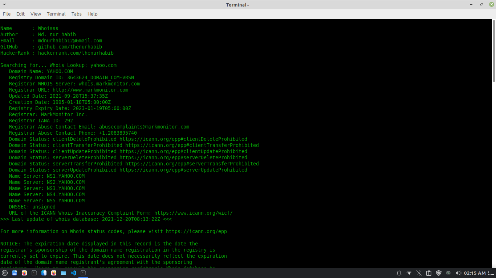

# Whoisss

Whoisss is a website information gatharing Tool. You can cse it to collect information about website.

### Usage
`apt-get update`  
`apt-get upgrade`  
`pkg install git`  
`pkg install python3`  
`git clone https://github.com/nurhabib1/whoisss`  
`cd whoisss`  
`python3 whoisss.py` 

## Screenshot

## 🔗 Links

## 🚀 About Me
I'm a programmer & Linux System Administrator.

## Author

- [@Md. Nur habib](https://www.github.com/nurhabib1)

